<p align="center">
  
</p>

<p align="center"><a href="README.md">🇬🇧 English</a> · <a href="README.it.md">🇮🇹 Italiano</a></p>

<p align="center">
  
  
  
  
  
</p>

> One scope-safe CLI for security assessment, detection, evidence collection and reporting.

<p align="center"><a href="SECURITY.md">Security</a> · <a href="LICENSE">Primary licence</a> · <a href="THIRD_PARTY_NOTICES.md">Third-party licences</a></p>

---

## Quick Navigation

- **[What is Olympus?](#what-is-olympus)** — what it does, and who it's for.
- **[Modules](#-modules)** — every tool, what it does, and its entry point.
- **[Installation](#-installation)** — one command, Python 3.11+.
- **[Quick start](#-quick-start)** — a verified recon → assessment → report path.
- **[Configuration](#-configuration)** — scope files, config, and secrets.
- **[Project structure](#-project-structure)** — how the repository is laid out.
- **[Development](#-development)** — required CI checks and local commands.
- **[Security model](#-security-model)** — scope, authorization, SSRF, audit.
- **[Migration](#-migration--specialist-engines)** — native ARGUS, AEGIS and specialist engines.
- **[Licences](#-licence-scope)** — MIT native code plus preserved vendored licences.
- **[Legal & ethical use](#-legal--ethical-use)** — authorized-only, in practice.

---

## What is Olympus?

Olympus is an offensive-and-defensive security platform driven through a single
binary. Instead of a drawer of unrelated scripts, every capability is a
sub-command of one CLI and speaks the **same data contract** — the same
`Asset`, `Finding`, `Event`, `Evidence`, `Alert` and `Incident` produced by one
module can be consumed by any other without translation.

Two design rules run through the whole project:

- **Offline-first, injected I/O.** Domain logic never talks to the network
  directly; it depends on small typed ports (HTTP client, DNS resolver, tool
  runner) so tests are deterministic and offline, and production wires in the
  real transport.
- **Scope-safe by construction.** Every command that touches a live target
  checks it against an explicit authorized scope first, blocks out-of-scope
  targets, and writes an audit record — never a silent drop.

```console
$ olympus --help
$ olympus argus dns --domain example.com --scope scope.json
$ olympus athena run plan.json --storage ./.athena
```

## 🧰 Modules

| Module | Entry point | What it does |
| --- | --- | --- |
| **Argus** | `olympus argus` | OSINT & passive recon: DNS, WHOIS/RDAP, web headers, IP, phone, email, MAC, accounts, CDN fronting, investigation graphs. |
| **Athena** | `olympus athena` | Assessment **orchestration & lifecycle**: validated plans, bounded job execution, durable SQLite storage, audit trail, reporting. |
| **Helios** | `olympus helios` | Scoped surface scanning and finding export. |
| **Artemis** | `olympus artemis` | Web application probing (fingerprint, content, XSS) within scope. |
| **Proteus** | `olympus proteus` | Social-engineering campaign modelling (authorized, simulated). |
| **Hermes** | `olympus hermes` | Secret & sensitive-data scanning with SARIF output. |
| **Apollo** | `olympus apollo` | Detection rules engine (red/blue) over normalized events. |
| **Minerva** | `olympus minerva` | Incident triage and chain-of-custody records. |
| **Vulcan** | `olympus vulcan` | Aggregation, deduplication, ranking and report rendering. |
| **Metis** | `olympus metis` | Deterministic capability routing, engagement plans, CTI cases, IOC correlation and operational reports. |
| **core** | `olympus core` | Shared data-contract utilities (e.g. `export-schemas`). |
| **AEGIS** | `olympus aegis` | Scope-gated scanner orchestration, capability readiness and maturity, durable SQLite jobs, cancellation, audit and explicit execution states. Native for 6 of 24 catalogued engines; `serve`/`migrate`/`workers` still need `vendor/`. |
| **Unified TUI** | `olympus ui` | Keyboard-first interface over every real Olympus command, with streamed output and process cancellation. |

> [!TIP]
> Run any module with `--help` to see its commands, or
> `olympus <module> <command> --help` for a command's options.

## 🚀 Installation

Olympus requires **Python 3.11+**.

```bash
git clone https://github.com/chiaraberti13/olympus-security
cd olympus-security
python -m pip install -e ".[dev]"      # or: make install
olympus --version
olympus ui
```

## 🎯 Quick start

Every network-active command needs a scope file naming the domains you are
authorized to touch:

```bash
cat > scope.json <<'JSON'
{ "engagement": "demo-2026", "allowed_domains": ["example.com"] }
JSON
```

Passive recon with Argus (writes a `core.Asset`/`core.Finding` bundle):

```bash
olympus argus dns   --domain example.com --scope scope.json
olympus argus whois --domain example.com --scope scope.json
olympus argus web   --url https://example.com --scope scope.json --output web.json
```

Orchestrate a whole assessment with Athena, then read the results:

```bash
olympus athena plan validate examples/input/athena-plan.json
olympus athena run examples/input/athena-plan.json --storage ./.athena --report
olympus athena status <ASSESSMENT_ID> --storage ./.athena
```

Athena uses the same canonical exit codes as every other module, so it scripts
cleanly in CI:

| Code | Meaning |
| --- | --- |
| `0` | Clean: full coverage, nothing to report. |
| `1` | Findings the caller may want to act on. |
| `2` | Usage or input error (bad flag, unreadable or invalid file, malformed scope). |
| `3` | Blocked: the target is outside the authorized scope, and it was logged. |
| `4` | Refused: an authorization or consent flag was required but not given. |
| `5` | Partial: coverage was lost, so any findings are **not** exhaustive. |
| `6` | Failed: nothing completed, so the result carries no information. |
| `7` | Cancelled on request before finishing. |

Codes `5` and `6` exist so a caller can tell "we looked everywhere and found
nothing" from "we could not look". A run that produced findings *and* lost
coverage exits `5`, not `1`: the findings are still printed, but the run must
not be read as exhaustive. A partial run is never reported as a clean one; see
[run status and coverage](docs/run-status.md).

### Platforms actually tested

Honesty over breadth — `requires-python = ">=3.11"` states what installs, not
what is verified:

| | Verified in CI | Not verified |
| --- | --- | --- |
| **OS** | Ubuntu (`ubuntu-latest`) | macOS, Windows |
| **Python** | 3.11 | 3.12, 3.13, 3.14 |

Olympus is developed and exercised on Linux. The core and CLI are written to be
portable, and the sandbox layer (`olympus.aegis.sandbox`) is POSIX-specific by
design — user drop and `setrlimit` have no Windows equivalent. Widening this
matrix is tracked in [`ROADMAP_HARDENING.md`](ROADMAP_HARDENING.md) §5.4.

## ⚙️ Configuration

- **Scope files** (JSON) authorize targets per engagement:
  `{"engagement": "...", "allowed_domains": [...], "excluded_domains": [...]}`.
  Argus IP/phone/account scopes use their own keys — see
  [`examples/input/`](examples/input).
- **`olympus.toml`** (optional) sets shared HTTP defaults; resolution order is
  `OLYMPUS_CONFIG` → `./olympus.toml` → `~/.olympus.toml`.
- **`olympus.policy.toml`** (optional) makes the execution bounds editable per
  engagement — timeout, deadline, concurrency, retries, backoff, interval,
  jitter — plus named profiles and an opt-in `lab` allowlist for private ranges
  you declare you own. Resolution order is `OLYMPUS_POLICY` →
  `./olympus.policy.toml` → `~/.olympus/policy.toml`. A policy may only *lower*
  a compiled-in ceiling; a file that exceeds one is rejected, never clamped.
  Inspect it with `olympus policy show|validate|diff|edit` — see
  [`docs/policy.md`](docs/policy.md).
- **Secrets** are read only from environment variables (e.g.
  `OLYMPUS_NUMVERIFY_KEY`) and are **never** logged, exported, or placed in
  reports.

## 🗂️ Project structure

```text
src/olympus/
├── cli.py            # unified `olympus` entry point
├── tui/              # unified keyboard-first terminal interface
├── core/             # shared contract: models, enums, http, config, policy, ids
├── argus/            # OSINT & passive recon (incl. ARGUS integration)
├── athena/           # assessment orchestration (VAP integration)
│   ├── domain/       # immutable plans, jobs, state machines, audit
│   ├── application/  # coordinator, registry, planning use cases
│   ├── adapters/     # sqlite, audit, reporting, and tool adapters
│   └── cli.py
├── helios/ artemis/ proteus/ hermes/ apollo/ minerva/ vulcan/
docs/                 # architecture (ADRs), parity manifests, reference
examples/             # scope files, plans, sample inputs/outputs
tests/                # offline, deterministic unit & contract tests
```

See the [terminal interface guide](docs/tui.md) for navigation, execution and
security behaviour.

## 🧪 Development

Ruff and the complete pytest suite are mandatory CI gates. Type checking remains
available as an additional local check. Functional readiness additionally
requires real execution evidence; a green CI run alone is not called parity.

```bash
make lint      # Ruff; required in CI
make test      # pytest; required in CI
make type      # mypy; additional local check
make check     # run the complete local quality suite
```

See [`docs/architecture/`](docs/architecture) for the accepted design decisions,
[`docs/contracts.md`](docs/contracts.md) for the versioned wire/storage compatibility rules,
[`docs/execution-policy.md`](docs/execution-policy.md) for shared authorization and runtime bounds,
[`docs/parity/`](docs/parity) for the upstream capability manifests, and
[`docs/professional-platform.md`](docs/professional-platform.md) for the
professional control-plane migration.

## 🔐 Security model

- **Scope enforcement** precedes any live lookup; blocked targets are audited.
- **Explicit authorization** (`--i-am-authorized`) gates privacy-sensitive
  OSINT (e.g. phone/email enrichment about a real person).
- **SSRF guard**: Athena adapters reject targets resolving to non-global IP
  literals and re-validate scope before every request.
- **Bounded execution**: shared HTTP timeouts/retries/rate limits, and Athena
  concurrency, per-job timeouts and overall deadlines with safe maxima.
- **Redacted audit trail**: append-only events with allowlisted metadata only —
  never credentials, bodies, or raw findings.

## 🔁 Migration & specialist engines

The standalone **ARGUS** migration is complete. Its maintained implementation is
`src/olympus/argus/`, exposed only as `olympus argus`; the duplicated
`vendor/argus` source and the `argus-native` passthrough have been removed.

AEGIS is **still being migrated** from the temporary vendored Vulnerability
Assessment Platform compatibility layer to an Olympus-owned control plane; it is
not finished. The native path already owns scope and authorization gates,
scanner adapters, capability readiness, durable SQLite jobs, cancellation, audit
and explicit execution states, and `olympus aegis doctor`, `deps`, `info`,
`scanners` and `capabilities` all run without the vendored tree. What is *not*
native yet: `aegis serve`, `aegis migrate` and `aegis workers` still require
`vendor/` and exit with code `2` without it, and the legacy web surface remains
temporary until its API, persistence and report contracts are replaced and
verified.

**How much of the catalogue actually executes.** The 24-scanner registry is a
catalogue, not an implementation claim. Today:

| Maturity | Count | Meaning |
| --- | --- | --- |
| `catalog-only` | 18 | Registry entry only; nothing executes. |
| `adapter-ready` | 0 | Adapter registered, parser unproven. |
| `offline-tested` | 2 | Parser proven against recorded output (`testssl`, `whatweb`). |
| `live-tested` | 4 | Run end to end against a real engine (`nmap`, `nikto`, `sqlmap`, `wafw00f`). |
| **`production-ready`** | **0** | Live-tested **and** the full Definition of Done met. |

No adapter is `production-ready` yet: the Definition of Done — per-adapter
evidence manifest with digests, SBOM, vulnerability scan and documented version
compatibility — is not met for any engine. `olympus aegis capabilities` reports
this per engine, and a CI job can enforce it with
`olympus aegis capabilities --min-maturity live-tested --count 4`. The
declarations are cross-checked against the repository on every test run, so the
table cannot quietly drift; see [`docs/scanner-maturity.md`](docs/scanner-maturity.md).

Specialist scanner engines are **integrated and governed, not copied**. Olympus
detects their installed versions, validates configuration, executes them within
an authorized scope, normalizes their output and records evidence. Their own
licences and installation channels remain authoritative.

```bash
olympus argus --help                       # native OSINT/recon surface
olympus argus doctor                       # dependency/config readiness

olympus aegis capabilities                 # ready state here + project maturity
olympus aegis jobs init                    # durable local job store
olympus aegis jobs submit nmap --target example.com --scope scope.json --i-am-authorized
olympus aegis jobs work                    # process one queued job
OLYMPUS_AEGIS_API_KEY='<32+ random chars>' olympus aegis api --scope-directory .olympus/scopes
olympus aegis scanners                     # specialist-engine catalogue
olympus aegis migrate                       # apply the VAP database migrations
olympus aegis serve --host 127.0.0.1 --port 8000   # serve the full VAP web app
```

### Running the complete VAP platform: native or Docker

**Native (single process, via Olympus):**

```bash
pip install -e ".[aegis]"            # or: bash scripts/setup-vendored-tools.sh
olympus aegis migrate               # apply the database migrations
olympus aegis serve --host 127.0.0.1 --port 8000
```

Redis is optional on the native path: synchronous features work without it, and
queued scans are disabled with a clear warning until Redis is running.

**Docker (full stack, one command):**

```bash
docker compose up --build         # redis + migrate + app + worker
docker compose down               # stop
docker compose down -v            # stop and remove the data volumes
# ...with the open-source scanner binaries baked in:
docker compose -f docker-compose.yml -f docker-compose.scanners.yml up --build
```

| Aspect | What the root `docker-compose.yml` provides |
| --- | --- |
| **Services** | `redis` (broker + result backend + API cache), `migrate` (one-shot Alembic), `app` (FastAPI web app), `worker` (Celery scan worker) |
| **Ports** | app on `http://localhost:8000` (override with `VAP_PORT`); Redis is **not** published to the host |
| **Volumes** | `vap-data` → `/data` (SQLite DB + generated reports), `redis-data` |
| **Initialization / migrations** | `migrate` runs `alembic upgrade head` and must finish (`service_completed_successfully`) before `app` and `worker` start; the app also self-migrates on boot |
| **Health checks** | app `GET /health`, `redis-cli ping`, `celery inspect ping` (with `depends_on: condition: service_healthy`) |
| **Environment** | `VAP_PORT`, `VAP_ENABLE_LIVE_SCANS` (default `false`), `VAP_REQUIRE_HTTPS`, `VAP_DATABASE_URL`, `VAP_CELERY_*`, `VAP_API_CACHE_*`, and secrets `VAP_API_KEY` / `VAP_JWT_SECRET` / `VAP_CSRF_SECRET` — documented in [`.env.docker.example`](.env.docker.example) |
| **Scanner dependencies** | The default image is Python-only, so a scanner whose binary is absent reports a clear "tool not installed" state. `docker-compose.scanners.yml` + [`docker/Dockerfile.scanners`](docker/Dockerfile.scanners) add the reliably-installable open-source scanners (nmap, nikto, whatweb, sqlmap, wafw00f, arjun, wapiti); Go-based (nuclei, httpx, katana, subfinder, dalfox), Ruby (wpscan), and commercial engines (burp, acunetix, nessus, openvas) are installed separately per their own licences |
| **Safe defaults** | live scanning off, HTTPS enforcement configurable, Redis unpublished, secrets blank by default |

For a hardened/HTTPS deployment or PostgreSQL instead of SQLite, set the
corresponding `VAP_*` variables (see `vendor/vulnerability-assessment-platform/.env.example`).

**Real scans, never fabricated:** `olympus aegis run <scanner> --target <t> --scope s.json --i-am-authorized` runs a real scanner with explicit states — `live` / `unavailable` / `failed` / `disabled` / `simulation`. Simulation is produced **only** with `--simulate` (or `AEGIS_SIMULATION_MODE=true`); a missing binary yields `unavailable`, never a fake finding. See [`docs/scanner-matrix.md`](docs/scanner-matrix.md) and [`docs/aegis-execution-evidence.md`](docs/aegis-execution-evidence.md).

External scanner **binaries** and the full runtime (Redis/Celery) are also
provisioned by the vendored `installer.sh` for a non-container setup; a scanner
with no binary present always reports "tool not installed" rather than failing
silently.

Olympus ships **native** implementations: `olympus argus …` (scope-first OSINT),
`olympus aegis …` (specialist-engine control) and `olympus athena …`
(assessment orchestration). Their
capability contracts and provenance are pinned in
[`docs/parity/`](docs/parity) and [`docs/provenance.md`](docs/provenance.md);
Athena's architecture is [ADR-002](docs/architecture/adr-002-athena-target-architecture.md).
Exhaustive walkthroughs live in [`docs/reference.md`](docs/reference.md).

## 📄 Licence scope

Olympus-native code, including native ARGUS and AEGIS, is MIT — see
[LICENSE](LICENSE). The temporarily vendored Vulnerability Assessment Platform is **GPL-3.0-only** and
retains its own licence. The root MIT licence does not relicense vendored code.
See [third-party notices](THIRD_PARTY_NOTICES.md) and
[provenance](docs/provenance.md).

## ⚠️ Legal & ethical use

Olympus performs **authorized** security testing. Passive modules query only
publicly available information; active modules connect only to targets inside a
declared scope. Use it exclusively where you have **documented permission**
(your own systems, a signed engagement, or a lab you control). Misuse is your
responsibility alone.
