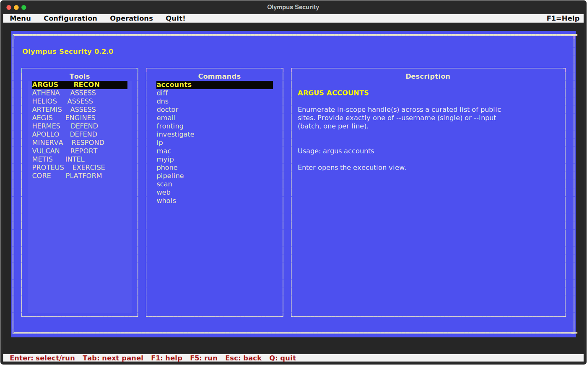

# Olympus terminal interface

`olympus ui` is the keyboard-first interface for the complete Olympus command
tree. It uses the same Typer/Click objects as the CLI, so newly registered tools
and leaf commands appear without maintaining a second execution catalogue.

## Operation

- **Arrow keys** select tools and commands.
- **Tab** moves between the tool and command panes.
- **Enter** opens the selected command.
- **F5** runs it with the arguments entered in the execution view.
- **Ctrl+C** requests termination of the child process.
- **Escape** returns to the command browser when no process is running.
- **F1** opens the help screen and **F10** returns focus to the tool menu.

The execution view launches `python -m olympus.cli` with a fixed argument
vector and no shell. Standard output and error stream into a bounded log; the
real process exit code remains visible. The TUI therefore does not reinterpret
results or replace the CLI's machine-readable outputs.

## Security boundary

The interface cannot bypass authorization, scope, SSRF, deadline, cancellation
or resource-limit controls. Commands that require `--scope` and
`--i-am-authorized` still require those arguments. Secrets remain environment
variables and should never be pasted into the argument field.

The palette follows the supplied Norton Utilities reference: blue work area,
ivory borders, black/yellow selection, white menu strip and red status text. A
true-colour terminal is recommended. Environments that deliberately set
`NO_COLOR` receive a readable grayscale fallback.
